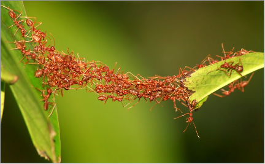
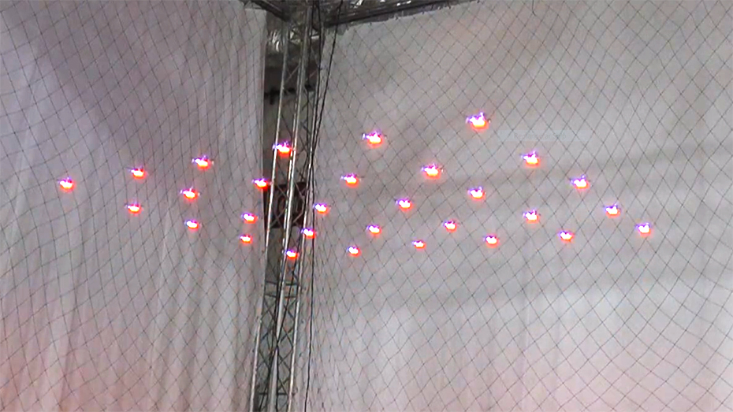
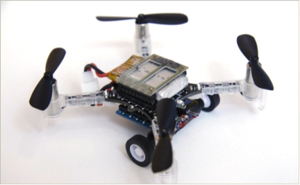
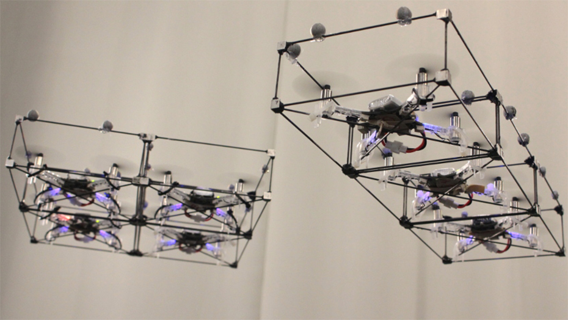
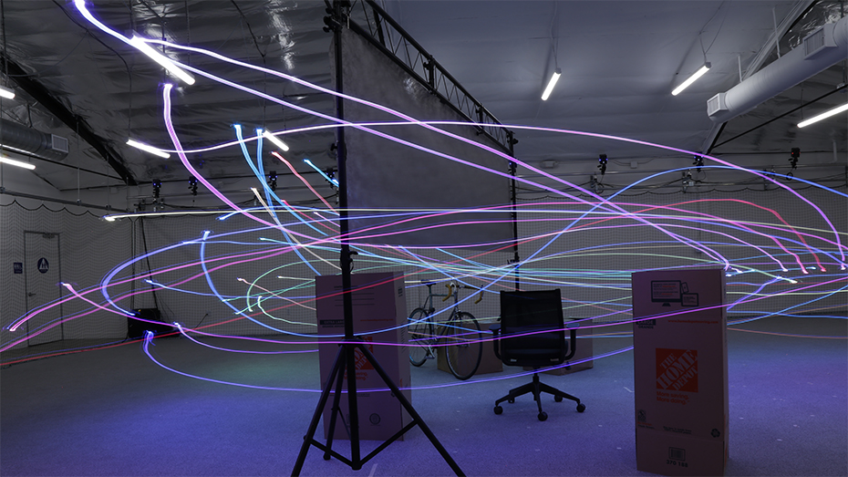
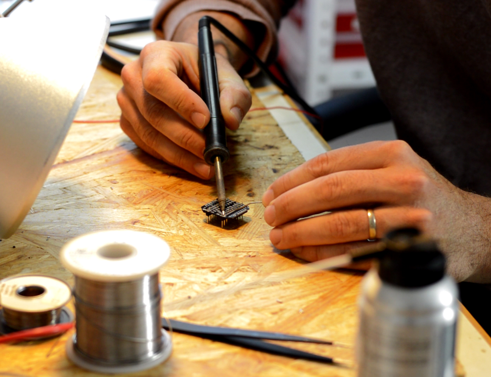
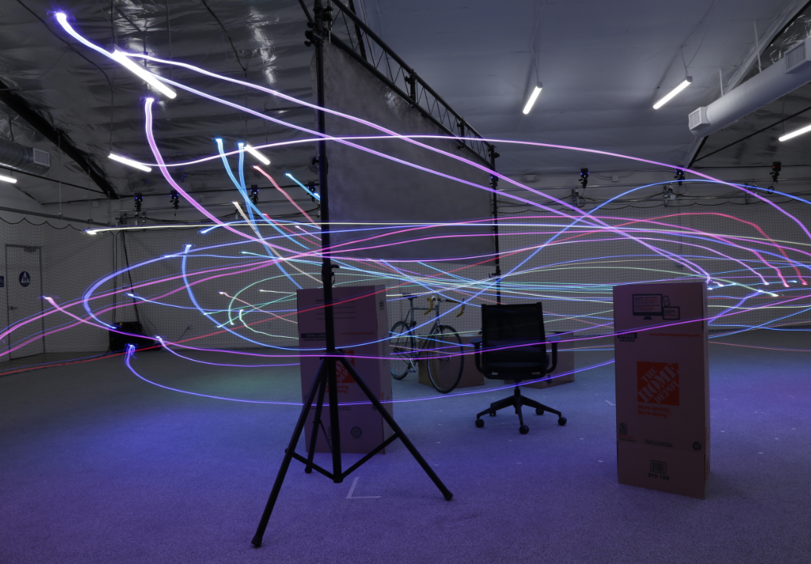
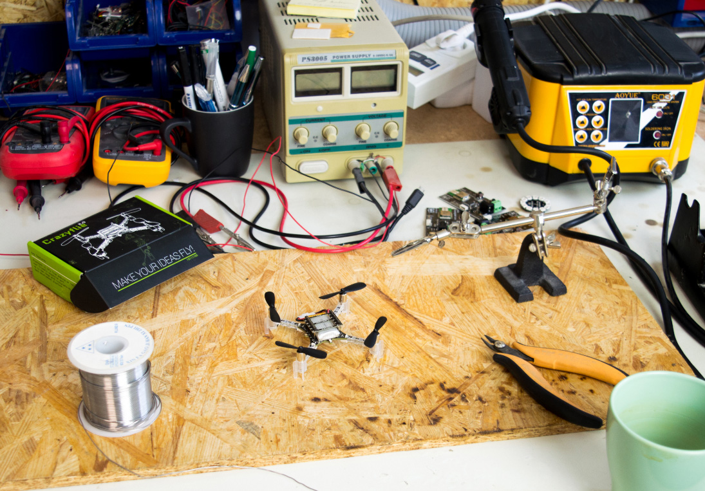

  

    

      <h1>Make your ideas fly!</h1>
      

        <a href="https://store.bitcraze.io/"><button type="button" class="btn btn-primary btn-block btn-color-primary">Shop</button></a>
        <a href="/start/"><button type="button" class="btn btn-primary btn-block btn-color-secondary">Getting started</button></a>
        <a href="https://github.com/bitcraze" class="mobile_hidden_button"><button type="button" class="btn btn-primary btn-block btn-color-secondary">Github</button></a>
      

    

    

      <h3>We create open platforms that enable people to explore the world of flying robotics</h3>
    

  

<!--Blog-->

  

    

      <h2>The latest from the blog</h2>
    

    

      

        <ul class="menu-blog">
          <li class="menu-item"><a href="/blog/">All posts</a></li>
          <li class="menu-item"><a href="/category/crazyflie/">Crazyflie</a></li>
          <li class="menu-item"><a href="/category/loco-positioning/">Loco positioning</a></li>
          <li class="menu-item"><a href="/category/guest-blogger/">Guest blogger</a></li>
        </ul>
      

    

  

  

    

      <!-- inject wp blog img 0 begin -->
      

        
      

      <h3 class="blog-title">
        <a>Placeholder post 1</a>
      </h3>
      <!-- inject wp blog img 0 end -->
    

    

      <!-- inject wp blog img 1 begin -->
      

        
      

      <h3 class="blog-title">
        <a>Placeholder post 2</a>
      </h3>
      <!-- inject wp blog img 1 end -->
    

    

      <!-- inject wp blog img 2 begin -->
      

        
      

      <h3 class="blog-title">
        <a>Placeholder post 3</a>
      </h3>
      <!-- inject wp blog img 2 end -->
    

  

  

    

      

        <h2>
          <a href="/blog/">All posts</a>
        </h2>
      

    

  

<!--Testimonials-->

  

    

        

          <h3>Developers and resechers around the world are using our platforms for all kinds of research areas. Here we have collected a few guest blog posts to show some examples.</h3>
        

    

    

      
      <article>“We use the Crazyflie platform to evaluate our algorithms because the hardware
               is robust and the user community has helped make firmware available on which we can base our
               own systems”
      </article>
      <h4>-Ellen Cappo, researcher at Carnegie Mellon University</h4>
    

    

      
      <article>“The Crazyflie is easily obtainable, safe, and (we can certify ourselves) very robust. Moreover, since it is open-source and fully programmable, we were able to easily modify the Crazyflie to fit our needs.”
      </article>
      <h4>-Brandon Araki, researcher at MIT</h4>
    

    

      
    <article>“The ModQuad is propelled by a quadrotor platform. We use the Crazyflie 2.0. The vehicle was chosen because of its agility and scalability. The low-cost and total payload gives us an acceptable scenario for a large number of modules.”
    </article>
    <h4>-David Saldaña, researcher at UPenn University</h4>
    

    

      
      <article>“The Crazyflie is a great platform for research because of its openness and extensibility; additionally, the size allows us to test algorithms on a swarm of robots even in space-limited indoor environments.”
      </article>
      <h4>-Wolfgang Hoenig, researcher at University of Southern California</h4>
    

  

<!-- Portals -->

<!-- Development portal -->

  

    

      

        <h3>The perfect development tool for your flying application</h3>
          
Prototype your flying application in the comfort of your lab.
            Modify or extend the firmware of the quadcopter to access or control your hardware - it is all open source.
          

      

    

    

      
    

  

<!-- Research portal -->
  

    

      

        <h3>The ideal for many areas of research</h3>
          
The platform is designed to be as flexible and versatile as possible to enable the user to explore the area of interest. for instance control algorithms, swarms, path finding, agriculture or failure recovery.
          

      

    

    

      
    

  

<!-- Education portal -->
  

    

      

        <h3>Bring the latest in robotics to your students</h3>
          
The crazyflie is a versatile platform that is made to engage people to learn about robotics and quadcopters.
            Help the students learn control algorithms, embedded systems, aeronautics or robotics by verifying their insights on a real quadcopter.
          

      

    

    

      
    

  

<!-- DIY portal -->
  

    

      

        <h3>Do it yourself</h3>
          
Love to fly? Like to tinker? Want to modify and explore? Hate limitations and closed systems? The Crazyflie is for you!
          

      

    

    

      
    

  

  <!-- Portals end -->

    

        

            <h2>Used by</h2>
        

        
        
        
        
        
        
        
        
        
        
        
        
        
        
        
        
        

      

      

        

Is your organization missing? <a href="https://github.com/bitcraze/bitcraze-website/edit/master/src/{{page.path}}"><i class="fa fa-pencil"></i> &nbsp;Improve this page</a>

          

      

<!-- 

  <i class="fa fa-chevron-down"></i>

 -->
