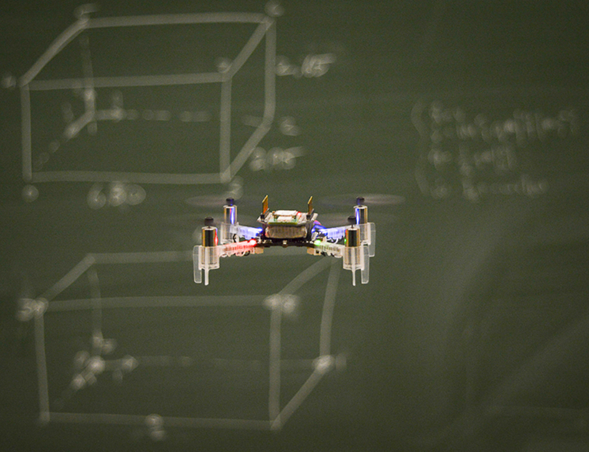

  

      

            
<h1>Bitcraze</h1>

            <h3>Make your ideas fly!</h3>
      

  

  

    

      <button type="button" class="btn btn-primary btn-block btn-color-primary">Shop</button>
    

    

      <button type="button" class="btn btn-primary btn-block btn-color-secondary">Getting started</button>
    

    

      <button type="button" class="btn btn-primary btn-block btn-color-secondary">Github</button>
    

  

  

    

      

        <h3>We create open platforms that enable people to explore the world of flying robotics</h3>
      

    

  

<!--Blog-->

  

    

      <h2>The latest from the blog</h2>
    

    

      

        <ul class="menu-blog">
          <li class="menu-item"><a href="/blog/">All posts</a></li>
          <li class="menu-item"><a href="/category/crazyflie/">Crazyflie</a></li>
          <li class="menu-item"><a href="/category/loco-positioning/">Loco positioning</a></li>
          <li class="menu-item"><a href="/category/guest-blogger/">Guest blogger</a></li>
        </ul>
      

    

  

  

    
 
      <!-- inject wp blog img 0 begin -->
      

        
      

      <h3 class="blog-title">
        <a>Placeholder post 1</a>
      </h3>      
      <!-- inject wp blog img 0 end -->       
    

    
 
      <!-- inject wp blog img 1 begin -->
      

        
      

      <h3 class="blog-title">
        <a>Placeholder post 2</a>
      </h3>      
      <!-- inject wp blog img 1 end -->       
    

    
 
      <!-- inject wp blog img 2 begin -->
      

        
      

      <h3 class="blog-title">
        <a>Placeholder post 3</a>
      </h3>      
      <!-- inject wp blog img 2 end -->       
    

  

<!--Testimonials-->

  

    

      

        <h3>Makers, developers and resechers from all around the world are using our stuff. Here are a few examples of why the Crazyflie 2.0 is an awesome platform</h3>
      

    

    

      
        <article>“We use the Crazyflie platform to evaluate our algorithms because the hardware
                 is robust and the user community has helped make firmware available on which we can base our
                 own systems”
        </article>
         
        <b>-Ellen Cappo, researcher at Carnegie Mellon University.</b>
    

    

      
        <article>“We use the Crazyflie platform to evaluate our algorithms because the hardware
                is robust and the user community has helped make firmware available on which we can base our
                own systems”
        </article>
         
        <b>-Ellen Cappo, researcher at Carnegie Mellon University.</b>
    

    

      
        <article>“We use the Crazyflie platform to evaluate our algorithms because the hardware
              is robust and the user community has helped make firmware available on which we can base our
              own systems”
        </article>
         
        <b>-Ellen Cappo, researcher at Carnegie Mellon University.</b>
    

     

       
        <article>“We use the Crazyflie platform to evaluate our algorithms because the hardware
          is robust and the user community has helped make firmware available on which we can base our
          own systems”
        </article>
         
        <b>-Ellen Cappo, researcher at Carnegie Mellon University.</b>
     

   

<!-- Portals -->

<!-- Development portal -->

  

    

      
    

    

      

        <h3>The perfect development tool for your flying application</h3>
          
Prototype your flying application in the comfort of your lab. Add sensors and other hardware as needed through the expansion ports. Modify or extend the firmware of the quadcopter to access or control your hardware - it is all open source.
          

      

    

  

<!-- Research portal -->

  

    

      

        <h3>ideal for many areas of research</h3>
          
The Crazyflie is the ideal tool for research in many areas, for instance control algorithms, swarms, path finding, agriculture or failure recovery. The platform is designed to be as flexible and versatile as possible to enable the user to explore the area of interest.
          

      

    

    

      
    

  

<!-- Education portal -->

  

    

      
    

    

      

        <h3>Bring the latest in robotics to your students</h3>
          
The crazyflie is a versatile development platform that is made to engage people to learn about robotics and quadcopters. Help the students acquire knowledge in areas like control algorithms, embedded systems, aeronautics or robotics by verifying their insights on a real quadcopter. Source code and hardware design is open and available to allow exploration and modification.
          

      

    

  

<!-- DIY portal -->

  

    

      

        <h3>Do it yourself</h3>
          
Love to fly? Like to tinker with toys? Want to modify and explore? Hate limitations and closed systems? The Crazyflie is for you!
          

      

    

    

      
    

  

  <!-- Portals end -->

    

        

            <h2>Used by</h2>
        

        
        
        
        
        
        
        
        
        
        
        
        
        
        
        
        
        

      

      

        

Is your organization missing? <a href="https://github.com/bitcraze/bitcraze-website/edit/master/src/{{page.path}}"><i class="fa fa-pencil"></i> &nbsp;Improve this page</a>

          

      

  <i class="fa fa-chevron-down"></i>

